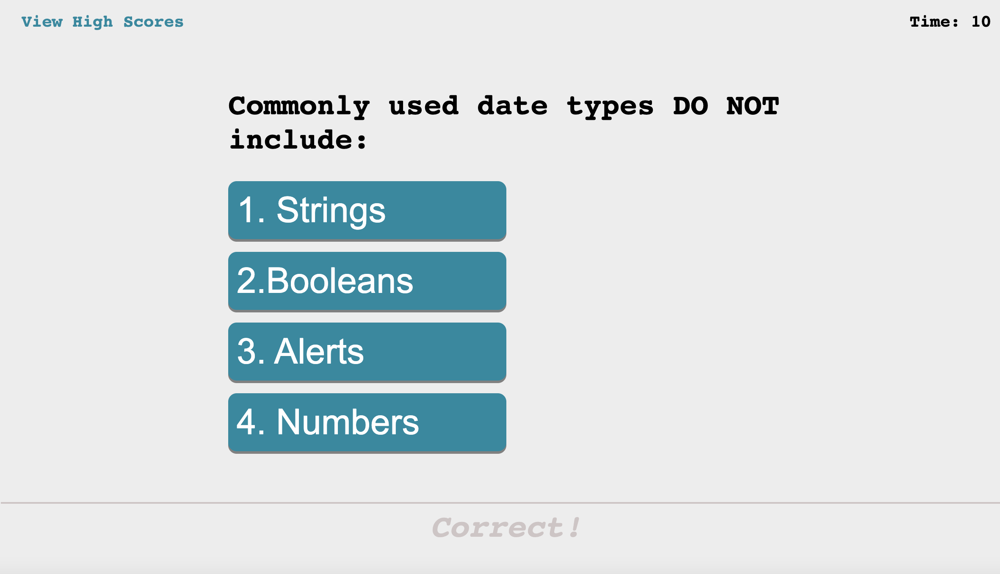

# Code-Quiz
## Description
This application will test your knowledge of javascript, css and html! Answer the questions under the time alloted. Each correct question will give you 5 points. Every incorrect question will substract 10 seconds from the timer. At the end, any extra time will be added to the final score. At the end you can save your final score and add to the list of high scores.

    
    
 

